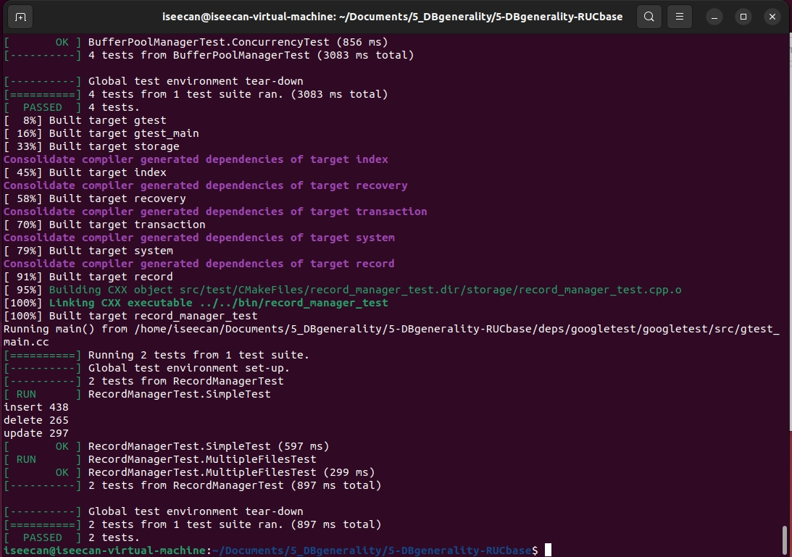
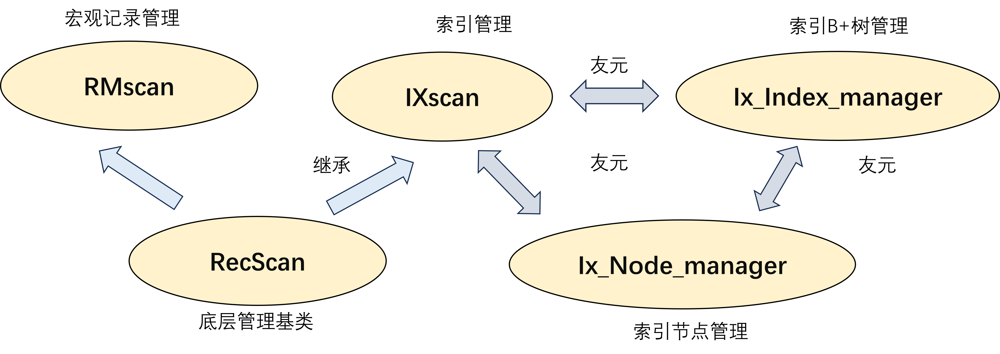
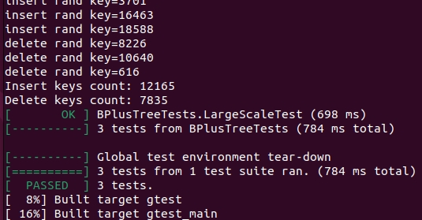
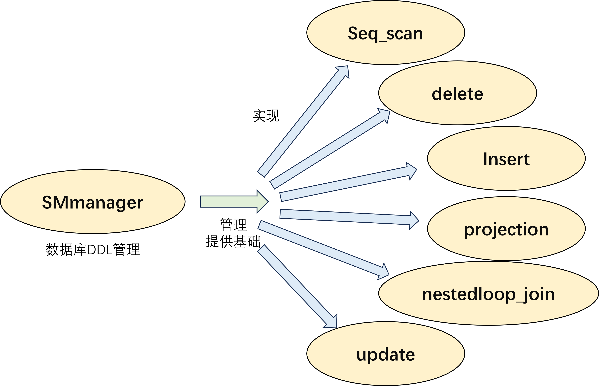
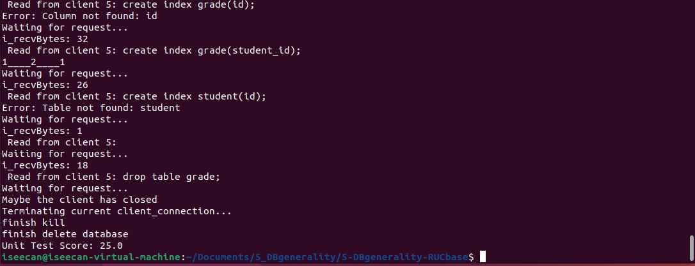
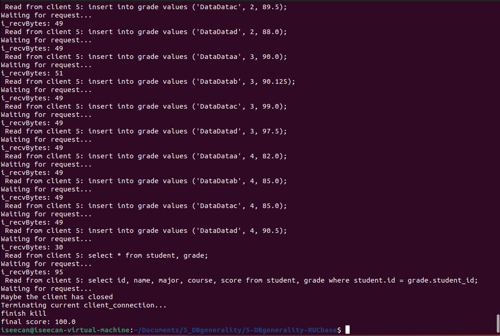
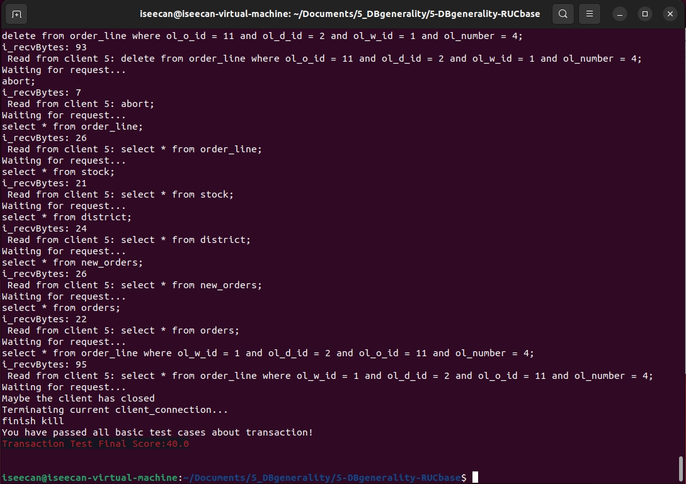
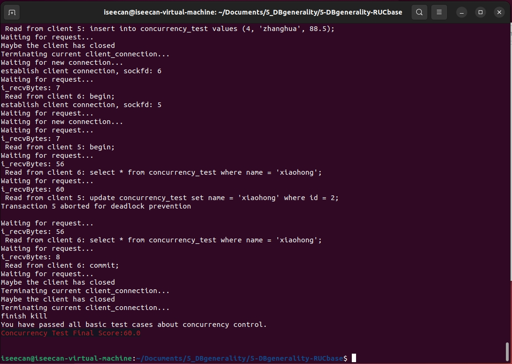

# RUC 数据库系统概论

- [RUC 数据库系统概论](#ruc-数据库系统概论)
  - [前置](#前置)
  - [实验一](#实验一)
    - [实验说明](#实验说明)
      - [任务一 缓冲池管理器](#任务一-缓冲池管理器)
        - [任务1.0 模块逻辑说明](#任务10-模块逻辑说明)
        - [任务1.1 磁盘存储管理器](#任务11-磁盘存储管理器)
        - [任务1.2 缓冲池替换策略](#任务12-缓冲池替换策略)
        - [任务1.3 缓冲池管理器](#任务13-缓冲池管理器)
      - [任务二 记录管理器](#任务二-记录管理器)
        - [任务2.1 记录操作](#任务21-记录操作)
        - [任务2.2 记录迭代器](#任务22-记录迭代器)
  - [实验二](#实验二)
    - [实验说明](#实验说明-1)
    - [具体实现](#具体实现)
  - [实验三](#实验三)
    - [任务一：元数据管理和DDL语句](#任务一元数据管理和ddl语句)
    - [任务二：DML语句实现](#任务二dml语句实现)
  - [实验四](#实验四)
    - [任务一 事务管理器实验](#任务一-事务管理器实验)
    - [任务二 并发控制实验](#任务二-并发控制实验)
  - [附加实验](#附加实验)

## 前置

具体项目安装配置见个人仓库[README](https://github.com/ISeeCan/5-DBgenerality-RUCbase)，官方项目仓库见[链接](https://github.com/ISeeCan/5-DBgenerality-RUCbase)

## 实验一

### 实验说明

[详细说明](https://github.com/ISeeCan/5-DBgenerality-RUCbase/blob/main/docs/Rucbase-Lab1%5B%E5%AD%98%E5%82%A8%E7%AE%A1%E7%90%86%E5%AE%9E%E9%AA%8C%E6%96%87%E6%A1%A3%5D.md)

#### 任务一 缓冲池管理器

##### 任务1.0 模块逻辑说明

- **BufferPoolManager** 是核心协调器，负责高效使用内存缓存。
- **DiskManager** 提供页面的磁盘读写接口，所有持久化操作依赖于它。
- **LRUReplacer** 提供替换策略，用于决定淘汰哪一页。

    

三者通过缓冲池（pages_）、页表（page_table_）和替换列表（free_list_）有机结合，共同实现数据库缓冲池的管理功能。

##### 任务1.1 磁盘存储管理器

需要完成[DiskManager](https://github.com/ISeeCan/5-DBgenerality-RUCbase/blob/main/src/storage/disk_manager.cpp)，最基本的rid结构是表示记录的唯一标识符：

格式：{page_no, slot_no}，指向记录所在的页面编号及槽位编号。

|     Func     |      Todo      | Explaination                                                           |
| :-----------: | :------------: | :--------------------------------------------------------------------- |
|  write_page  |     写文件     | 根据文件大小lseek至偏移位置，写后进行大小检验                          |
|   read_page   |     读文件     | 根据文件大小lseek至偏移位置，读后进行大小检验                          |
| allocate_page |   分配新页号   | 采用单纯的自增策略                                                     |
|    is_file    | 是不是普通文件 | 调用 `stat(path.c_str(), &st)`，获取指定路径的文件信息并判断文件类型 |
|  create_file  |    创建文件    | 使用O_CREAT模式调用open()函数                                          |
| destroy_file |    删除文件    | 先关闭已打开的文件，再进行删除                                         |
|   open_file   |    打开文件    | 如果已经打开，直接返回文件描述符就行                                   |
|  close_file  |    关闭文件    | 先检查是否已经打开，不能关闭未打开者                                   |
| get_file_size |  获得文件大小  | 使用stat获得文件大小                                                   |
| get_file_name |   获得文件名   | 使用fd2path_哈希表获得名称                                             |
|  get_file_fd  |   获得文件id   | 使用path2fd_哈希表获得文件名称                                         |
|   read_log   |     读日志     | 使用名称打开日志，结合日志大小进行读操作                               |
|   write_log   |     写日志     | 使用名称打开日志，进行写操作                                           |

**注意**：

使用 std::atomic<page_id_t> 保证多线程环境下页面号分配的安全性

##### 任务1.2 缓冲池替换策略

需要完成[LeastRecentlyUsed_Replacer](https://github.com/ISeeCan/5-DBgenerality-RUCbase/blob/main/src/replacer/lru_replacer.cpp)

|  Func  |     Todo     | Explaination                                   |
| :----: | :----------: | ---------------------------------------------- |
| victim | 获取淘汰目标 | 从链表中获得最后一个元素，将其从LRUhash_内移除 |
|  pin  |   固定元素   | 通过id查找要固定的页面，不再追踪管理           |
| unpin |   取消固定   | 通过id查找要固定的页面，如果未被追踪则添加     |

Replacer类使用双向链表std::list维护页面的访问顺序，其链表头部是最近使用的页面，尾部是最久未使用的页面；并且使用无序哈希表std::unordered_map来实现高效的页面查找和链表操作。同时支持并发操作，利用 std::scoped_lock 确保线程安全。

##### 任务1.3 缓冲池管理器

需要完成[BufferPoolManager](https://github.com/ISeeCan/5-DBgenerality-RUCbase/blob/main/src/storage/buffer_pool_manager.cpp)

|       Func       |     Todo     | Explaination                                                                                        |
| :--------------: | :----------: | --------------------------------------------------------------------------------------------------- |
| find_victim_page |  寻找替换页  | 若缓冲池已满，则通过LRU选择被替换页，否则返回空页                                                   |
|   update_page   |   更新页面   | 写回脏页，删除后替换为新页                                                                          |
|    fetch_page    |   获取页面   | 若已位于缓冲区，则直接获取并计数，否则利用上述两个函数选择页面替换                                  |
|    unpin_page    | 取消固定页面 | 查找页面，减少 `pin_count_`，如果计数为 0（不再被任何进程使用），则通知**Replacer**解除固定 |
|    flush_page    |   写回磁盘   | 查找页面，调用**DiskManager**写回磁盘，重置藏标志                                             |
|     new_page     |  创建新页面  | 寻找空闲帧，调用**DiskManager** 分配新页面ID并update                                          |
|   delete_page   |   删除页面   | 查找页面，如果未被pin，则利用**DiskManager**删除                                              |
| flush_all_pages |   写回所有   | 遍历所有页面并逐个写回，重置脏标志                                                                  |

**BufferPoolManager**是调用对**DiskManager**和**LRUReplacer**的顶层调用，实现了更加宏观的各种操作。注意上锁。

#### 任务二 记录管理器

##### 任务2.1 记录操作

需要实现[RmFileHandle](https://github.com/ISeeCan/5-DBgenerality-RUCbase/blob/main/src/record/rm_file_handle.cpp)

| Func                   | Todo         | Explaination                                    |
| ---------------------- | ------------ | ----------------------------------------------- |
| get_record             | 获取特定记录 | 获取page handle，并生成指向他的指针             |
| insert_record          | 插入记录     | 可以通过指定位置向表内插入记录                  |
| delete_record          | 删除记录     | 删除特定记录，并更新需要更新的元数据            |
| update_record          | 更新记录     | 修改特定位置记录                                |
| fetch_page_handle      | 获取页面     | 根据页面位置获取页面，并封装为page_handle并返回 |
| create_new_page_handle | 创建新页面   | 创建新页面并初始化相关元数据                    |
| create_page_handle     | 创建页面     | 优先返回空闲页面，均占用后创建新页面            |
| release_page_handle    | 刷新元数据   | 如果出现了空闲页面，则刷新相关数据              |

##### 任务2.2 记录迭代器

要求补全[RmScan](https://github.com/ISeeCan/5-DBgenerality-RUCbase/blob/main/src/record/rm_scan.cpp)

| Func         | Todo     | Explaination                                             |
| ------------ | -------- | -------------------------------------------------------- |
| file_handle_ | 构造函数 | 利用RmFileHandle初始化相关元数据                         |
| next         | 遍历     | 使用 `rid_.page_no` 遍历，并且通过位图找到下一个有效的 |
| is_end       | 判断结尾 | 辅助函数，判断是否已经遍历到了结尾                       |
| rid          | 获取rid_ | 辅助函数，获取私有参数                                   |

    

    

## 实验二

### 实验说明

[详细说明](https://github.com/ISeeCan/5-DBgenerality-RUCbase/blob/main/docs/Rucbase-Lab2%5B%E7%B4%A2%E5%BC%95%E7%AE%A1%E7%90%86%E5%AE%9E%E9%AA%8C%E6%96%87%E6%A1%A3%5D.md)

    

    

需要实现[ix_index_handle](https://github.com/ISeeCan/5-DBgenerality-RUCbase/blob/main/src/index/ix_index_handle.cpp)，实际上本实验主要是进行b+树相关操作与维护

### 具体实现

- IxNodeHandle 节点维护

| Func            | Todo                                | Explaination                              |
| --------------- | ----------------------------------- | ----------------------------------------- |
| lower_bound     | 查找节点中第一个大于等于target的key | 在此使用二分查找进行实现                  |
| upper_bound     | 查找节点中第一个小于等于target的key | 在此使用二分查找进行实现                  |
| leaf_lookup     | 查找目标key                         | 先使用lowerbound获取位置然后判断是否存在  |
| internal_lookup | 获取目标key物理位置                 | 查找key所在叶子节点位置，然后返回页面位置 |
| insert_pairs    | 在指定位置插入n个连续的键值对       | 分别获取n个连续key,rid值，插入到pos       |
| insert          | 插入一个键值对                      | 先查找位置，然后插入                      |
| erase_pair      | 删除键值对                          | 分别删除key,rid, 然后更新数量             |
| remove          | 删除目标key                         | 先查找位置，然后删除                      |

- IxIndexHandle b+树维护

| Func                     | Todo         | Explaination                                       |
| ------------------------ | ------------ | -------------------------------------------------- |
| find_leaf_page           | 查找叶子节点 | 从根节点一路向下查找，最终返回叶子                 |
| get_value                | 查找key位置  | 先查找到叶子节点，然后于页内寻找，返回是否存在     |
| split                    | 节点拆分     | 超过节点上限，拆分右半部分为子节点，调整指针与计数 |
| insert_into_parent       | 插入到父节点 | 分裂过程中不断向父节点插入，直到结束甚至调整根     |
| insert_entry             | 插入节点     | 先寻找插入到哪个叶子，然后判断分裂与操作           |
| delete_entry             | 删除节点     | 先寻找到叶子节点并删除，然后判断合并与操作         |
| coalesce_or_redistribute | 操作逻辑判断 | 根据操作后节点结构与计数进行调整或b+树结构改变     |
| adjust_root              | 调整根节点   | 主要针对根的删除，选择新根或标记无效               |
| redistribute             | 重分配       | 根据b+树逻辑，当前节点与邻居关系进行内容重分配     |
| coalesce                 | 合并         | 如果重分配无法解决问题，则进行（级联的）合并       |

具体逻辑可以参考[相关网站](https://www.cs.usfca.edu/~galles/visualization/BPlusTree.html)示例

    

    

## 实验三

[具体指导](https://github.com/ISeeCan/5-DBgenerality-RUCbase/blob/main/docs/Rucbase-Lab3%5B%E6%9F%A5%E8%AF%A2%E6%89%A7%E8%A1%8C%E5%AE%9E%E9%AA%8C%E6%96%87%E6%A1%A3%5D.md)

[详细说明](https://github.com/ISeeCan/5-DBgenerality-RUCbase/blob/main/docs/Rucbase-Lab3%5B%E6%9F%A5%E8%AF%A2%E6%89%A7%E8%A1%8C%E5%AE%9E%E9%AA%8C%E6%8C%87%E5%AF%BC%5D.md)

本实验要求实现各数据库算子

    

### 任务一：元数据管理和DDL语句

需要完成[sm_manager](https://github.com/ISeeCan/5-DBgenerality-RUCbase/blob/main/src/system/sm_manager.cpp)

| Func         | Todo       | Explaination                                      |
| ------------ | ---------- | ------------------------------------------------- |
| create_db    | 创建数据库 | 创立路径，初始化元数据                            |
| drop_db      | 删除数据库 | 删除相关数据库文件                                |
| open_db      | 打开数据库 | 加载元数据与文件                                  |
| flush_meta   | 刷入磁盘   | 刷入磁盘                                          |
| close_db     | 关闭数据库 | 调用rm_manager,ix_manager分别关闭文件，索引       |
| show_tables  | 输出表     | 分割，输出表信息至output.txt                      |
| desc_table   | 输出元数据 | 调用**RecordPrinter**输出元数据             |
| create_table | 创建表     | 初始偏移为0，打开文件初始化元数据                 |
| drop_table   | 删除表     | 删除表相关文件                                    |
| create_index | 创建索引   | 调用ix_manager_创建索引，调用RmFileHandle写入记录 |
| drop_index   | 删除索引   | 删除索引相关文件                                  |

### 任务二：DML语句实现

- 实现[delete](https://github.com/ISeeCan/5-DBgenerality-RUCbase/blob/main/src/execution/executor_delete.h)

删除相关文件及索引

- 实现[insert](https://github.com/ISeeCan/5-DBgenerality-RUCbase/blob/main/src/execution/executor_insert.h)

创建缓冲区暂存数据，分别添加至文件及索引

- 实现[projection](https://github.com/ISeeCan/5-DBgenerality-RUCbase/blob/main/src/execution/executor_projection.h)

创建缓冲区，拷贝相应位置数据，即为索引

- 实现[nestedloop_join](https://github.com/ISeeCan/5-DBgenerality-RUCbase/blob/main/src/execution/executor_nestedloop_join.h)

先检验确保左右表变量类型一致，使用双层嵌套循环，逐个遍历左表的每行记录，与每个右表信息链接

- 实现[seq_scan](https://github.com/ISeeCan/5-DBgenerality-RUCbase/blob/main/src/execution/executor_seq_scan.h)

迭代扫描比较，直到遇到一个符合条件的后返回

- 实现[update](https://github.com/ISeeCan/5-DBgenerality-RUCbase/blob/main/src/execution/executor_update.h)

搜索相关数据位置，直接替换为新值

    

    

## 实验四

[详细说明](https://github.com/ISeeCan/5-DBgenerality-RUCbase/blob/main/docs/Rucbase-Lab4%5B%E5%B9%B6%E5%8F%91%E6%8E%A7%E5%88%B6%E5%AE%9E%E9%AA%8C%E6%96%87%E6%A1%A3%5D.md)

**注意，实验四及Bonus代码位于分支Lab4**。

### 任务一 事务管理器实验

需要完成[transaction](https://github.com/ISeeCan/5-DBgenerality-RUCbase/blob/main/src/transaction/transaction_manager.cpp)

| Func   | Todo     | Explaination                                         |
| ------ | -------- | ---------------------------------------------------- |
| begin  | 事务开始 | 创建新事务，添加至全局哈希表                         |
| commit | 事务提交 | 提交所有操作，释放锁，更新日志                       |
| abort  | 事务回滚 | 根据事务操作执行完全相反的动作，最后释放锁，回滚日志 |

### 任务二 并发控制实验

需要完成[lock_manager](https://github.com/ISeeCan/5-DBgenerality-RUCbase/blob/main/src/transaction/concurrency/lock_manager.cpp)

    

    

## 附加实验

[详细说明](https://github.com/ISeeCan/5-DBgenerality-RUCbase/blob/main/docs/Rucbase-Lab4%5B%E5%B9%B6%E5%8F%91%E6%8E%A7%E5%88%B6%E5%AE%9E%E9%AA%8C%E6%96%87%E6%A1%A3%5D.md)
